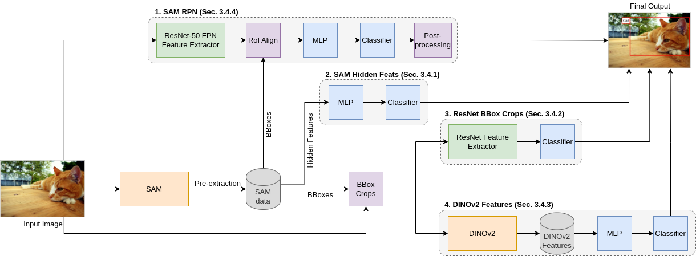
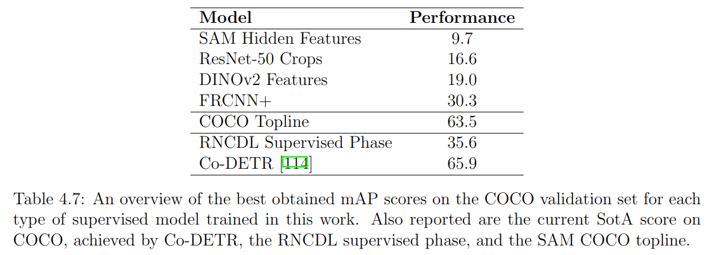
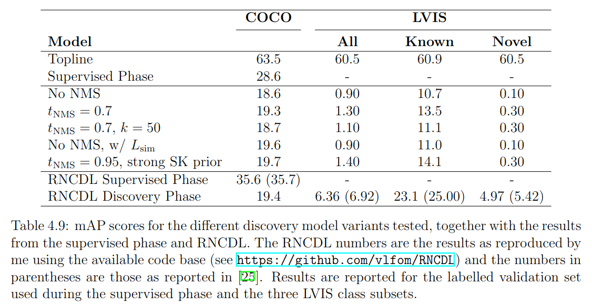

# An Exploration into Assigning Semantics to SAM

This repository contains the complete codebase for the work on attachting semantics to the [Segment Anything Model (SAM)](https://github.com/facebookresearch/segment-anything). The work consists of two main parts:
1. A fully-supervised part, where SAM learns the task of classifying bounding boxes for the [COCO dataset](https://cocodataset.org/#home).
2. A semi-supervised discovery part, where SAM learns the known classes from the COCO annotations and discovers novel classes from the [LVIS dataset](https://www.lvisdataset.org/), using the [RNCDL method](https://github.com/vlfom/RNCDL) from Fomenko et al.

The report is available [here](https://scripties.uba.uva.nl/search?id=record_53673).

## Abstract
The recent introduction and promise of the Segment Anything Model (SAM) has opened up many possibilities in the field of object detection and instance segmentation. A vital part missing from SAM, which is completely class-agnostic, is the ability to classify objects. This work is a first exploration into assigning semantics to SAM. First, the quality of the bounding boxes predicted by SAM is calculated with regard to ground truth annotations. Then these boxes are used in both a fully-supervised as well as a category discovery setting. SAM is an attractive candidate for category discovery, as it has no bias towards known classes. Interestingly, I find that even careful application of SAM is outperformed by models trained from scratch across all settings, even though the boxes obtained from SAM are of high quality. The model's many proposals seem to limit its applicability for the tasks and further exploration is necessary.

## Fully-Supervised Pipeline

The figure gives an overview of the different pipelines that were explored for the fully-supervised setting:
1. The SAM RPN.
2. The model trained on hidden features extracted from SAM.
3. The ResNet models trained on the bounding box crops.
4. The model trained on the DINOv2 features extracted from the bounding box crops.

## Fully-Supervised Results

## Discovery Results

## References
Kirillov, A., Mintun, E., Ravi, N., Mao, H., Rolland, C., Gustafson, L., ... & Girshick, R. (2023). Segment anything. arXiv preprint arXiv:2304.02643.

Fomenko, V., Elezi, I., Ramanan, D., Leal-Taixé, L., & Osep, A. (2022). Learning to Discover and Detect Objects. Advances in Neural Information Processing Systems, 35, 8746-8759.

Oquab, M., Darcet, T., Moutakanni, T., Vo, H., Szafraniec, M., Khalidov, V., ... & Bojanowski, P. (2023). Dinov2: Learning robust visual features without supervision. arXiv preprint arXiv:2304.07193.

He, K., Zhang, X., Ren, S., & Sun, J. (2016). Deep residual learning for image recognition. In Proceedings of the IEEE conference on computer vision and pattern recognition (pp. 770-778).

Lin, T. Y., Maire, M., Belongie, S., Hays, J., Perona, P., Ramanan, D., ... & Zitnick, C. L. (2014). Microsoft coco: Common objects in context. In Computer Vision–ECCV 2014: 13th European Conference, Zurich, Switzerland, September 6-12, 2014, Proceedings, Part V 13 (pp. 740-755). Springer International Publishing.

Gupta, A., Dollar, P., & Girshick, R. (2019). Lvis: A dataset for large vocabulary instance segmentation. In Proceedings of the IEEE/CVF conference on computer vision and pattern recognition (pp. 5356-5364).
